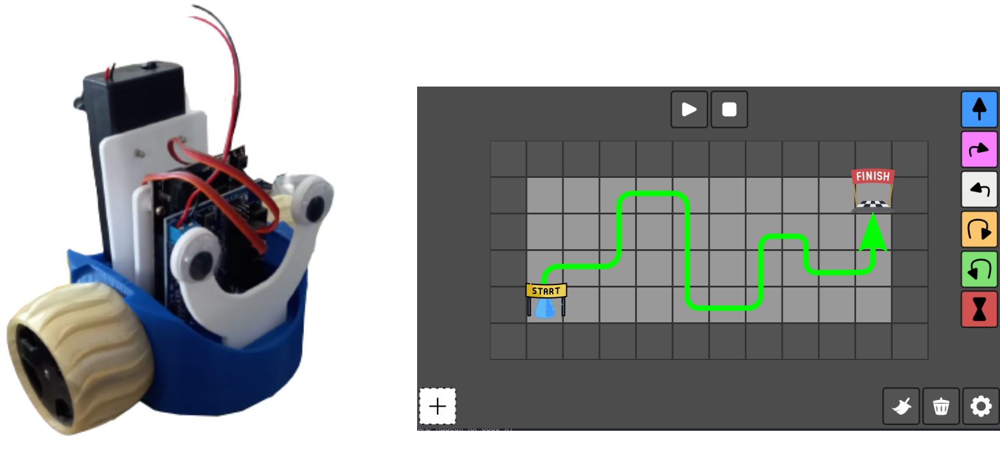

# ESP32 Godot Comunication

## 🗒 Introducción
En este proyecto, se propone la creación de un entorno interactivo al conectar un robot impreso en 3D con el motor de juego Godot. La combinación de la tecnología de impresión 3D y el desarrollo de juegos permite la creación de actividades interactivas únicas y atractivas.

## 🎯 Objetivo
El objetivo principal de este proyecto es conectar un robot impreso en 3D con el motor de juego Godot para diseñar y ejecutar una serie de pequeñas actividades interactivas. Estas actividades permitirán a los usuarios interactuar con el robot a través del entorno virtual creado en Godot, brindando una experiencia envolvente y educativa.

## 🔨 Instalación
Para correr esta aplicación se necesita descargar los siguientes programas:
* [Arduino](https://www.arduino.cc/en/software)
* [Godot (Version 4)](https://godotengine.org/download/)
* [Godot (Version 3.x)](https://godotengine.org/download/)(Para el ejemplo de Domino)

## Ejemplo: Domino
El ejemplo de domino trata de controlar un pequeño robot a travez de una aplicación echa en Godot.

Ver video en youtube.

